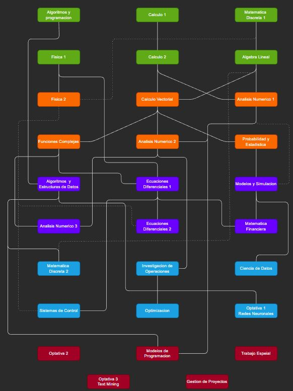

# 📚 Licenciatura en Matemática Aplicada (LMA) - Materias - FAMAF

Repositorio colaborativo con materiales, enlaces y recursos de estudio para las materias de la **Licenciatura en Matemática Aplicada (LMA)** de FAMAF - UNC.  
El objetivo es organizar y facilitar el acceso a apuntes, prácticas, resúmenes, exámenes y proyectos por materia y año.

> 💡 Este repositorio está en desarrollo permanente. ¡Contribuciones son bienvenidas!
## Primer año
### [1º 1C - Algoritmos y Programación](https://github.com/FAMAF-resources/LMA-1ro_1C-Algoritmos_y_Programacion-FAMAF)
### [1º 1C - Matemática Discreta I](https://github.com/FAMAF-resources/1ro_1C-Matematica_Discreta_I-FAMAF)
### [1º 1C - Cálculo I](https://github.com/FAMAF-resources/1ro_1C-Analisis_Matematico_I-FAMAF)
### [1º 2C - Física I](https://github.com/FAMAF-resources/LMA-1ro_2C-Fisica_I-FAMAF)
### [1º 2C - Álgebra Lineal](https://github.com/FAMAF-resources/1ro_2C-Algebra-FAMAF)
### [1º 2C - Cálculo II](https://github.com/FAMAF-resources/1ro_2C-Analisis_Matematico_II-FAMAF)

## Segundo año
### [2º 1C - Física II](https://github.com/FAMAF-resources/LMA-2do_1C-Fisica_II-FAMAF)
### [2º 1C - Cálculo Vectorial](https://github.com/FAMAF-resources/LMA-2do_1C-Calculo_Vectorial-FAMAF)
### [2º 1C - Análisis Numérico I](https://github.com/FAMAF-resources/2do_1C-Analisis_Numerico_I-FAMAF)
### [2º 2C - Funciones Complejas](https://github.com/FAMAF-resources/LMA-2do_2C-Funciones_Complejas-FAMAF)
### [2º 2C - Análisis Numérico II](https://github.com/FAMAF-resources/LMA_LM-2do_2C-Analisis_Numerico_II-FAMAF)
### [2º 2C - Probabilidad y Estadística](https://github.com/FAMAF-resources/2do_2C-Probabilidad_y_Estadistica-FAMAF)

## Tercer año
### [3º 1C - Ecuaciones Diferenciales I](https://github.com/FAMAF-resources/LMA-3ro_1C-Ecuaciones_Diferenciales_I-FAMAF)
### [3º 1C - Modelos y Simulación](https://github.com/FAMAF-resources/4to_1C-Modelos_y_Simulacion-FAMAF)
### [3º 1C - Algoritmos y Estructura de Datos](https://github.com/FAMAF-resources/2do_2C-Algoritmos_y_estructura_de_datos_II-FAMAF)
### [3º 2C - Análisis Numérico III](https://github.com/FAMAF-resources/LMA-3ro_2C-Analisis_Numerico_III-FAMAF)
### [3º 2C - Matemática Financiera](https://github.com/FAMAF-resources/LMA-3ro_2C-Matematica_Financiera-FAMAF)
### [3º 2C - Ecuaciones Diferenciales II](https://github.com/FAMAF-resources/LMA-3ro_2C-Ecuaciones_Diferenciales_II-FAMAF)

## Cuarto año
### [4º 1C - Investigación de Operaciones](https://github.com/FAMAF-resources/LMA-4to_1C-Investigacion_de_Operaciones-FAMAF)
### [4º 1C - Matemática Discreta II](https://github.com/FAMAF-resources/3ro_1C-Matematica_Discreta_II-FAMAF)
### [4º 1C - Ciencia de Datos](https://github.com/FAMAF-resources/LMA-4to_1C-Ciencia_de_datos-FAMAF)
### [4º 2C - Sistemas de Control](https://github.com/FAMAF-resources/LMA-4to_2C-Sistemas_de_Control-FAMAF)
### [4º 2C - Optimización](https://github.com/FAMAF-resources/LMA-4to_2C-Optimizacion-FAMAF)

## Quinto año
### [5º 1C - Modelos de Programación](https://github.com/FAMAF-resources/3ro_1C-Paradigmas_de_la_Programacion-FAMAF)
### [5º 2C - Gestión de Proyectos](https://github.com/FAMAF-resources/LMA-5to_2C-Gestion-de-Proyectos-FAMAF)

# 📌 Correlativas

# 🔄 Equivalencias con otras carreras

>  *Estas equivalencias están sujetas a cambios. Se recomienda consultar con la facultad y con algún docente antes de realizar un cambio de carrera.*

| Materia LMA                    | Materia en otra carrera   | Aclaración                                                                                         |
|-------------------------------|------------------------------------------------------------------------------------------|----------------------------------------------------------------------------------------------------|
| Cálculo I                     | Misma materia para LCC |                                         |
| Matemática Discreta I         | Misma materia para LCC |                                         |
| Cálculo II                    | Misma materia para LCC |                                         |
| Álgebra Lineal                | Misma materia para LCC, LM, LF, LA, LH (con nombres similares) |    |
| Análisis Numérico I           | Misma materia para LCC, LM | Los alumnos de LCC no realizan el laboratorio. Es recomendable cursarla como alumno de LMA o LM.  |
| Cálculo Vectorial             | Análoga a Análisis Matemático III (LM), con un enfoque más práctico  | Suele tomarse un coloquio con la unidad 3 "Curvas y superficies" para alumnos de otra carrera. |
| Funciones Complejas           | Análoga a Funciones Analíticas (LM), con un enfoque más práctico. Incluso puede ser la misma materia segun el año | Puede tomarse un coloquio con la última unidad: Análisis de Fourier.                              |
| Análisis Numérico II          | Misma materia para LM  |                  |
| Probabilidad y Estadística    | Misma materia para LCC |                                                                                                    |
| Algoritmos y Estructura de Datos | Misma que Algoritmos y Estructuras de Datos II (AYED2) de LCC                        |   |
| Ecuaciones Diferenciales I    | Análoga a Ecuaciones Diferenciales Ordinarias (LM), con un enfoque más práctico.Incluso puede ser la misma materia segun el año | |
| Modelos y Simulación          | Misma materia para LCC  |
| Ecuaciones Diferenciales II   | Análoga a Ecuaciones Diferenciales II (LM), con un enfoque más práctico.Incluso puede ser la misma materia segun el año                |          |
| Matemática Financiera         | Optativa en LCC, LM, PF y LF (conocida como Modelos Matemáticos en Finanzas Cuantitativas) |     |
| Matemática Discreta II        | Misma materia para LCC |
| Investigación de Operaciones  | Optativa en LCC  |
| Ciencia de Datos              | Optativa en LCC (conocida como Introducción al Machine Learning)  |                                                   |
| Optimización                  | Optativa en LCC  |                                                                                                    |
| Modelos de Programación       | Optativa en LCC  conocida como Paradigmas de Programacion | En LMA se cubren solo 2/3 de la materia. Se recomienda cursarla como alumno de LCC.               |

## 🤝 Cómo contribuir

Este repositorio está abierto a contribuciones de estudiantes o egresados/as que deseen compartir material útil.

- Si tenés apuntes, parciales, proyectos o cualquier recurso de una materia, ¡sumalo!
- Podés hacer un fork, subir tus cambios y abrir un Pull Request.
- También podés abrir un *issue* para proponer ideas o reportar errores en los enlaces.

> ✉️ Si tenés dudas o querés colaborar directamente, podés contactarnos en recursos.estudio.estudiantes@gmail.com .